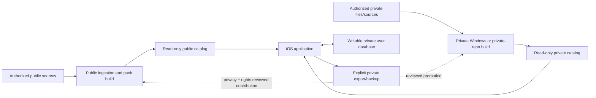

# System Architecture

**Status:** Proposed baseline  
**Normative source:** [Consolidated project scope](../PROJECT_SCOPE.md)

## 1. Architecture goals

- Operate offline without a required hosted runtime backend.
- Keep writable user data physically separate from read-only reference catalogs.
- Permit public and private reference data to compose without losing origin or rights.
- Make external sources replaceable through connector contracts.
- Support Windows-first shared development while reserving native claims for physical iOS tests.
- Fail closed on missing rights, classification, compatibility, integrity, or storage prerequisites.
- Ship an iOS-only consumer product initially; the browser is a deterministic QA harness and Android is outside the approved platform scope.
- Display selected routes without turn-by-turn instructions, rerouting, or off-route guidance.

## 2. System context



There is no automatic phone-to-public-catalog path. Dashed promotion paths require explicit user selection and review.

## 3. Runtime components

| Component | Responsibility | Trust/data boundary |
| --- | --- | --- |
| React Native application | Screen flow, UI, state orchestration, queries, import/export UX | Does not directly implement source acquisition or turn-by-turn navigation |
| Native Swift tracker | Background Core Location, low-frequency barometer/motion summaries, batching, durable tracker state | Active only during an explicit recording; sole writer to the protected active spool |
| Map adapter | MapLibre commands/events and platform capability differences | Native rendering accepted only on physical iOS |
| Tracker/sensor adapters | Stable shared ports and browser deterministic fixtures | Browser fixtures do not prove native behavior |
| Private user store | Activities, user trails/places, favorites, notes, photos, overlays, settings, audit/export history | Writable; never replaced by catalog activation |
| Public catalog | Redistributable reference entities and search indexes | Read-only, versioned, signed/checksummed |
| Private catalog | Permission-limited reference entities | Read-only, versioned, signed/checksummed, installed/distributed privately |
| Catalog coordinator | Compatibility, free-space preflight, staging, remap/promotion, atomic activation, rollback | Cannot delete user records |
| Import/export service | Validates user files, privacy trimming, backup/share artifacts | Treats every file as untrusted/private by default |

## 4. Build-time components

| Component | Responsibility |
| --- | --- |
| Connector SDK | `discover`, `fetch`, `store_raw`, `parse`, `normalize`, `validate`, `checkpoint`, `emit` contracts |
| Rights/classification engine | Evaluates acquisition, retention, field, derivation, attribution, offline, and distribution permissions |
| Isolated acquisition workers | Retrieve authorized sources with limits, retries, secret redaction, and per-source failure isolation |
| Raw artifact store | Immutable/content-addressed permitted payloads plus retrieval metadata; public/private roots separate |
| Spatial staging | PostgreSQL/PostGIS or accepted equivalent for validation, normalization, entity resolution, and coverage |
| Canonical processor | Field-level provenance, candidate generation, reversible links, merges/splits, tombstones |
| Camping evaluator | Versioned, deterministic, time/spatial/authority-aware status calculation |
| Basemap builder | Pinned OSM extract to local vector tiles/style/assets with attribution |
| Pack builder | Region/detail selection, rights filtering, indexes, manifest, checksum, size/coverage/exclusion reports |
| Publication gate | Prevents private/restricted/unclassified artifacts from public GitHub, CI, or releases |

## 5. Data stores

### 5.1 Private user database

- Writable SQLite in the app container.
- Stable user UUIDs; immutable raw activity observations; versioned derived results.
- Migrations are transactional and independently versioned from catalogs.
- Backup/export is explicit and encrypted where it contains the full private state.
- The sealed database, active spool, attachments, diagnostics, and catalogs use the protection and system-backup behavior in the [iOS data protection and backup policy](IOS_DATA_PROTECTION_AND_BACKUP.md).
- The native tracker writes only its versioned active spool. The application storage coordinator imports complete idempotent batches and is the sole writer to the sealed database; catalog readers never receive write access.

### 5.2 Reference catalogs

- Separate public and optional private read-only SQLite/vector-tile artifacts.
- Every catalog records bundle ID, schema/content version, source rights, attribution, coverage, freshness, compatibility, size, checksums, signature, signer/key ID, channel, and anti-replay version.
- Query composition retains `public-reference`, `private-reference`, or `user` origin.
- Catalog failure/rollback cannot roll back the user database.

### 5.3 Processing roots

- Public build root: public or approved redistributable raw/fixture inputs and outputs only.
- Private build root: permission-limited raw, staging, media, logs, evidence, and packs.
- A private root must resolve outside the public checkout in the Windows local mode.
- Public tooling must never use the repository as an implicit private-data default.

## 6. Principal runtime flows

### 6.1 Record a hike

1. UI requests start through `TrackerAdapter`.
2. Native tracker establishes durable session and sequence.
3. Location/barometer values are filtered lightly and delivered in bounded batches.
4. Native code durably appends sequenced batches/checkpoints to the active spool; the storage coordinator idempotently imports them into the sealed private store and exposes state to UI.
5. Pause/resume creates explicit segments; finish seals the immutable activity.
6. Versioned distance/elevation processing creates derived results.
7. Matching offers reference/user trail association or a new `UserTrail`.

### 6.2 Build and activate a catalog

1. Authorized input enters its classified acquisition root.
2. Connector persists permitted raw material and validates/normalizes envelopes.
3. Canonical processing resolves entities and evaluates rights/status/coverage.
4. Pack builder emits catalog, manifest, checksum, signature/provenance, reports, and classification.
5. Device checks compatibility/free space, stages and verifies the catalog.
6. Coordinator validates remap/promotion tables and atomically activates.
7. First successful launch/integrity check retires the old compatible catalog.

### 6.3 Explicit private promotion

1. User selects a trail/correction and privacy trimming.
2. Export contains only selected record/evidence and stays private.
3. Private pipeline validates and may include it in a future private catalog.
4. Public promotion additionally requires redistribution rights, privacy review, and a normal public contribution.
5. Later catalog supplies a promotion link; the private original remains intact.

## 7. Proposed repository layout

The exact monorepo tooling is an open decision, but implementation should converge on this responsibility split:

```text
apps/
  mobile/                 React Native/Expo application
  web-fixture/            browser QA harness
packages/
  domain/                 canonical types and pure rules
  storage/                SQLite ports, migrations, composed queries
  tracking/               shared tracker state/calculations
  maps/                   map adapter contracts and shared styles
  import-export/          file models and privacy transformations
native/
  ios-tracker/            Swift tracking service
tools/
  connectors/             connector SDK and source packages
  ingestion/              workers and security boundary
  catalog/                canonical processing and pack builder
  basemap/                tile build profile
config/
  release/                machine-readable pins and budgets
  sources/                public source manifests
fixtures/
  synthetic/              approved public fixtures
docs/                     planning and technical documentation
```

Private extensions use a parallel structure in an external root or private downstream repository and implement published package/manifest contracts.

## 8. Key interfaces

- `TrackerAdapter`: start, pause, resume, finish, recover, batches, state/events.
- `SensorAdapter`: relative altitude, motion summary, battery, permissions.
- `MapAdapter`: sources/layers, camera, selection, location/route, feature queries, capability flags.
- `CatalogReader`: text/spatial queries, entity details, provenance, origin, effective status.
- `CatalogCoordinator`: stage, validate, activate, rollback, remap, promotion, integrity state.
- `Connector`: capability-declared acquisition/parse/normalize/validate stages.
- `RightsEvaluator`: decision plus reasons for acquisition, retention, derivation, inclusion, and publication.
- `PrivateExtensionManifest`: compatible core range, package entries, sources, catalog classification, build hooks allowed by policy.

Interface schemas are versioned. Breaking changes require a migration/compatibility decision and private-extension impact review.

## 9. Security and privacy boundaries

- Network, archives, GIS, imports, metadata, URLs, and media are untrusted.
- Native/complex parsers run with resource limits and isolated staging.
- Public CI has no private payload or release secret on untrusted pull requests. Private builds use ephemeral isolated jobs and never run untrusted heads with private credentials.
- Secret values are stored in approved credential services, never manifests/logs/fixtures.
- Classification and rights metadata are mandatory; absence blocks build/publication.
- Backups use vetted authenticated encryption and staged all-or-nothing restore.
- Git ignore rules supplement but do not define the privacy boundary.

The normative boundaries and mitigations are in the [threat model](THREAT_MODEL.md); local logging/export rules are in the [diagnostics plan](DIAGNOSTICS_PLAN.md). All cross-component entity representations follow the [canonical data specification](CANONICAL_DATA_SPEC.md).

## 10. Architecture acceptance

Architecture is accepted for implementation when:

- Phase 0 open decisions have accepted ADRs;
- a clean public skeleton and synthetic private extension compile independently;
- data-store boundaries are represented in schema/API tests;
- public/private build roots and publication destinations are enforceable;
- device feasibility confirms the native/runtime assumptions; and
- the RTM maps every architecture-significant requirement to a package and verification method.
